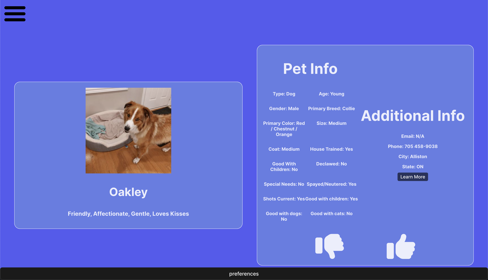

# PurrfectPets

Discover your ideal companion using PurrfectPets – the ultimate destination for pet adoption. Customize your preferences, and witness a delightful array of adorable pets right at your fingertips. Express your affection by liking your favorite pets, and with a simple click, we'll guide you to the PetFinder website, connecting you directly with the shelter or owner. Your journey to finding the perfect pet begins here.

## Project Overview

PurrfectPets is a platform dedicated to pet adoption, allowing users to discover their ideal companions. Customize your preferences, interact with adorable pets, and seamlessly connect with shelters or owners through the PetFinder website.



## How to contribute

### Getting Started

#### Recommended / Required Development Utilities

* NodeJS version 20.x or higher
* Git
* PetFinder API Keys

#### Contributing and Staying Up to Date

Follow the [project board](https://github.com/orgs/cis3296f23/projects/118) to stay updated on the project's status. If you want to contribute:

1. Clone this GitHub repository.
2. Create your own branch off of Production or Dev.
3. Run `npm install` to install all dependencies needed.
4. Use your preferred IDE for development.
5. Open a Pull Request to Dev

#### How to build

* Ensure all packages are up to date and installed by running `npm install`
* Ensure API keys are in the `.env` file.

```

PETFINDER_API_KEY=<your api key>
PETFINDER_API_SECRET=<your api secret>
AZURE_SQL_SERVER=purrfectpetssql.database.windows.net
AZURE_SQL_DATABASE=purrfectpetsusers
AZURE_SQL_PORT=1433
AZURE_SQL_USER=<your username>
AZURE_SQL_PASSWORD=<your password>
```

* Run `npm run dev` to start an instance of the app on Localhost.
* Click on http://localhost:5173/

